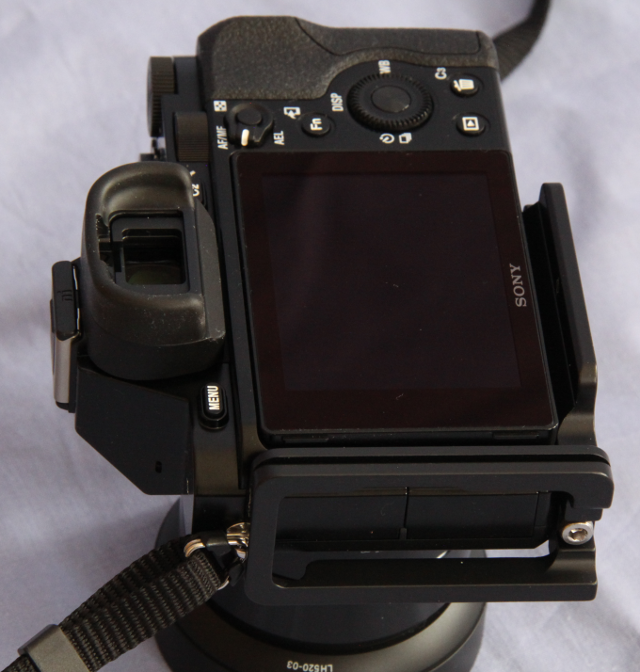

Présentation du matériel
===========================

Trépied
-------

Je possède deux trépieds :

- `Manfrotto 190PROB
  <http://www.manfrotto.com/professional-aluminium-tripod-black-without-head>`_
  ;
- Velbon MAXi 343e.

Mise à niveau
-------------

Au lieu de la traditionnelle rotule que j'ai utilisée pendant un moment, j'ai
acheté une platine de mise à niveau `EZ Leveller 2
<http://shop.nodalninja.com/ez-leveler-ii-no-case-f3138/>`_.

Il y a plusieurs raisons à ce choix :

- la sécurité : quand je débloquais la rotule par erreur, l'ensemble barillet,
  tête panoramique et photoscope basculait soudainement de manière inattendue.
  On risquait d'endommager le matériel ou de se blesser au visage ;

- le confort : quand la tête panoramique était montée sur la rotule, la bulle de
  niveau de la tête panoramique m'arrivait presque sous le nez (je suis de
  taille moyenne) ce qui me posait un problème d'accomodation (presbythie !).
  Avec la platine et sans la rotule, la tête est à  une hauteur suffisamment
  basse pour que je puisse observer le niveau à bulle sans problème ;

- la précision : avec la platine de mise à niveau, on agit sur un seul paramètre
  du niveau avec la précision d'un pas de vis ;

- la compatibilité : je peux visser ma rotule sur la platine de mise à niveau
  quand nécessaire ;

Têtes panoramiques
------------------

Je possède deux têtes panoramiques : une Nodal Ninja 5 et  une Nodal Ninja 3:

- La `Nodal Ninja 5
  <http://www.galerie-photo.com/panoramique-nodal-ninja_nn5.html>`_ équipée d'un
  barillet `RD16 <http://shop.nodalninja.com/advanced-rotator-rd16-ii-f1161/>`_.
  La Nodal Ninja 5 n'est actuellement plus fabriquée mais vous pouvez vous
  procurer la nouvelle `Nodal Ninja 4
  <http://shop.nodalninja.com/nn4-w-rd16-ii-advanced-rotator-f4503/>`_. Ces deux
  éléments restent solidairement fixés ;
- La `Nodal Ninja 3 <http://shop.nodalninja.com/nn3-mkii-starter-package/>`_.

Je leur ai adjoint un système de montage rapide `Arca Style Quick Release System
ASQRS2
<http://shop.nodalninja.com/arca-swiss-style-quick-release-clamp-f2105/>`_. Cela
permet de monter/démonter le photoscope rapidement.

**Liens**

- `Les têtes panoramiques
  <http://www.guide-photo-panoramique.com/tetes-panoramiques-assemblage-panorama.html>`_

Photoscopes
-----------

Je possède deux photoscopes : un Sony Alpha 7R et un Sony Alpha 6000 :

**Sony Alpha 7R**

Au `Sony Alpha 7R <http://www.sony.fr/product/dsi-body/ilce-7r>`_, J'ai adjoint
un plateau de montage rapide PS-A7 et LS-A7 de marque Markins monté sur le
photoscope en permanence. Je tiens signaler la remarquable conception et
finition de ce plateau et du L associé. Ce dernier peut se démonter si
nécessaire. Malgré la présence du L, l'accès aux trappes des connecteurs est
préservé.

**Sony Alpha 6000**

Au `Sony Alpha 6000
<http://www.sony.fr/electronics/appareils-photo-a-objectifs-interchangeables/ilce-6000-body-kit>`_,
j'ai adjoint un plateau de montage rapide `LB-A6000
<http://www.aliexpress.com/store/product/Fittest-LB-A6000-L-Plate-for-a6000-Digital-Mirrorless-Camera-Custom-L-Bracket-Arca-Swiss-RRS/710202_1884887270.html>`_
monté sur le photoscope en permanence.

Télécommande
------------

Pour éviter les aller-retours incessant sur le bouton de déclenchement ainsi que
les flous de bouger, l'utilisation d'une télécommande est plus que recommandée.
Celle adaptée aux Sony Alpha 7R et Alpha 6000 est la
`M-VPR1 <http://www.sony.fr/product/cac-other-accessories/rm-vpr1/produits-compatibles>`_.

Objectifs
---------

Le Samyang 24 mm :

Le Samyang 12 mm :

Ces objectifs présentent une intéressante caractéristique : il n'y a aucun
couplage entre le boitier et l'objectif. Cela signifie que tous les réglages
(mise au point et ouverture) sont manuels. Pratiquement, l'objectif reste fermé
à la valeur souhaitée en permanence. Bien que cela soit vu comme un inconvénient
par certains, cela fait en fait un objectif de choix pour la photographie
panoramique. Par contre, en tant qu'objectif bon marché, il souffre d'un
problème de décentrement qu'il va falloir corriger.

J'utilise ces objectifs exclusivement pour la photographie panoramique. J'ai
donc immobilisé les règlages de manière définitive par de l'adhésif photo
(gaffer).

Assemblages des matériels
-------------------------

Voici comment j'assemble ces matériels :

Equipement "standard" :

- Trépied Manfrotto 190PROB ;
- EZ Leveller 2 ;
- Nodal Ninja 5 + RD16 ;
- Sony Alpha 7R ;
- Samyang 24 mm.

Equipement d'appoint pour voyager léger :

- Trépied Velbon MAXi 343e ;
- Nodal Ninja 3 ;
- Sony Alpha 6000 ;
- Samyang 12 mm.

**Liens**

Fabriquants

- `Sony <http://www.sony.fr/>`_ ;
- `Ninja : têtes panoramiques <http://www.nodalninja.com/>`_ ;
- `Samyang <http://www.samyang-europe.com/>`_ ;
- `Manfrotto : trépieds, monopods et têtes panoramiques <http://www.bogenimaging.fr/Jahia/>`_ ;
- `Markins <http://www.markinseurope.com/en/>`_ ;

Commerçants en ligne (je les ai tous essayés et aucun ne m'a posé de problème)

- `PhotoProShop <http://www.photoproshop.com/>`_ ;
- `Digit Photo <http://www.digit-photo.com/>`_ ;
- `Optique Bourdeau <http://optique-bourdeau.com/>`_ ;
- `Amazon <http://www.amazon.fr>`_ ;
- `Miss Numérique <http://missnumerique.com/>`_ ;
- `Pixmania <http://pixmania.com/>`_ ;
- `Rue du Commerce <http://www.rueducommerce.fr/>`_ .
- `CDiscount </https://www.cdiscount.com/>`_ ;
