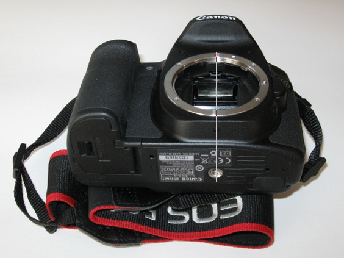
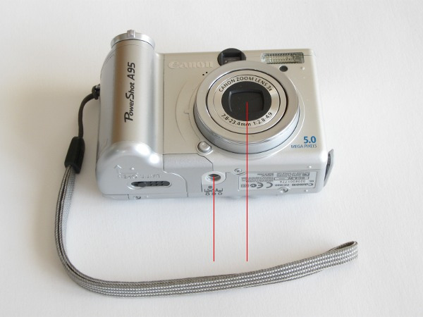
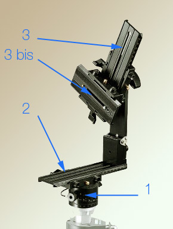

Préparatifs
===========

Ces réglages sont à faire une seule fois pour toute pour toutes les combinaisons
photoscope / objectifs.

Si comme sur mon photoscope l’écrou de fixation est dans le plan vertical de
l’axe optique, tout va bien.

Sinon, comme pour le photoscope ci-dessous, il faudra utiliser une `plaque
d’adaptation <http://www.pointnodal.eu/48-nodal-ninja-t-adapter.html>`_ ;
(`utilisation
<http://www.nodalninja.com/nn5-fr/appareils-photos-grips-avec-vis-de-fixation-decentree/11/>`_)
pour ramener le point de fixation dans ce plan.

A titre d'illustration, voici une tête panoramique qui propose une platine (la 3
bis dans l'image ci-dessous) pour corriger ce décalage :

Source de l'image : le `site d'Arnaud Frisch
<http://www.guide-photo-panoramique.com/tetes-panoramiques-assemblage-panorama.html>`_.

Voir également vidéo qui présente une platine d'adaptation en forme de T :

`Fanotec T adapter - How It Works <https://www.youtube.com/watch?v=yTlL5dSBKUA>`_ ;

.. include:: 3.1-centrage.rst
.. include:: 3.2-pupille-entree.rst
.. include:: 3.3-hyperfocale.rst
.. include:: 3.3-hyperfocale.rst
.. include:: 3.4-schema-prise-de-vue.rst
.. include:: 3.5-repere-nadir.rst
.. include:: 3.6-correction-distorsion.rst
