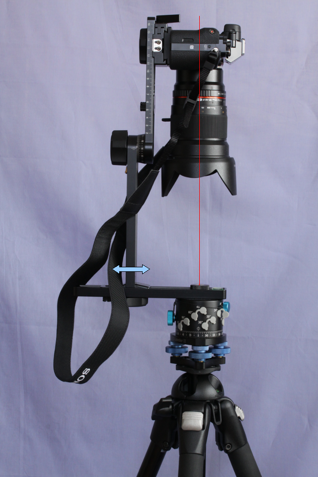
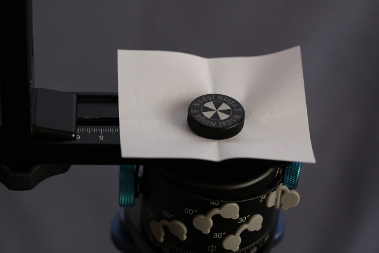
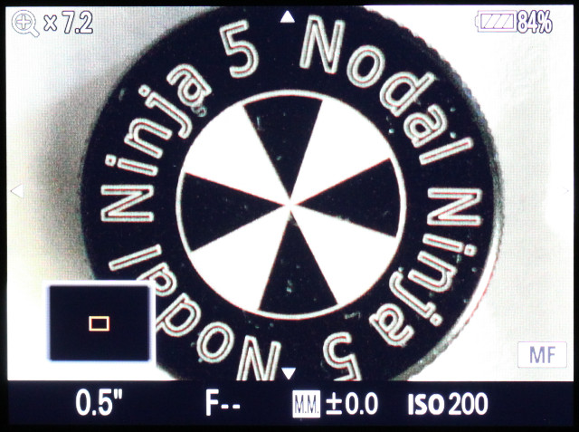

Centrage du photoscope sur l’axe de rotation
--------------------------------------------

L'objectif est d'aligner l’axe optique du photoscope avec l’axe de rotation
vertical de la tête panoramique. Pour cela, orientez le bras rotatif de la tête
panoramique de telle sorte que le photoscope vise parfaitement verticalement
vers le bas.

Le but est de placer le repère central de la tête panoramique au centre de
l'écran arrière du photoscope. Pour cela, effectuez une translation du bras
vertical de la tête panoramique le long du bras horizontal, comme illustré
ci-dessous :

Pour faciliter le centrage, placez une feuille de papier sous le repère central
de la tête panoramique.

Le résultat final est le suivant, en appliquant un grossissement de manière que
le répère central occupe tout l'écran :

