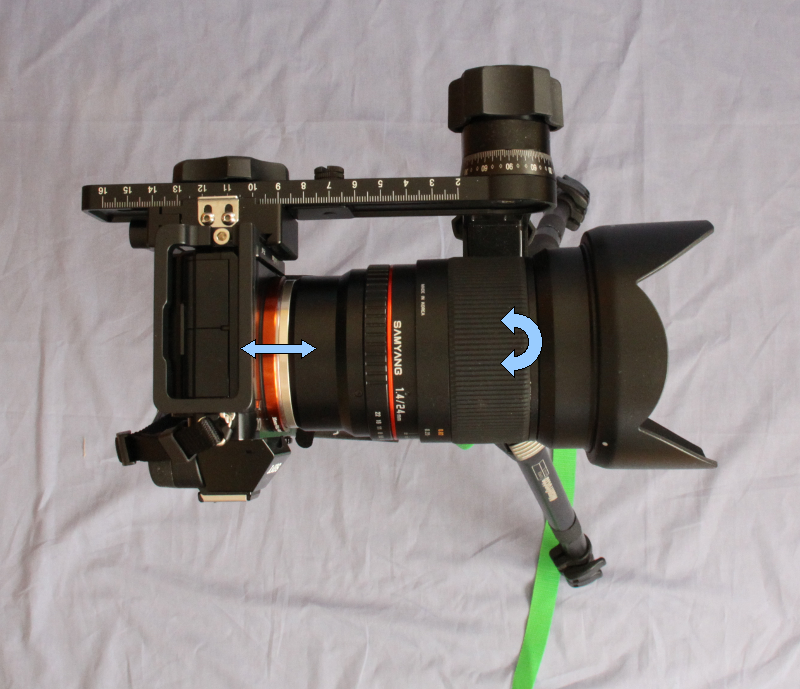
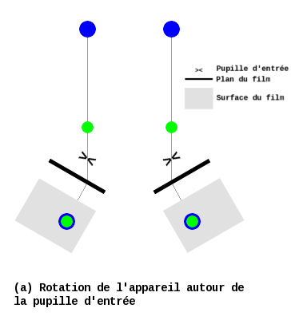
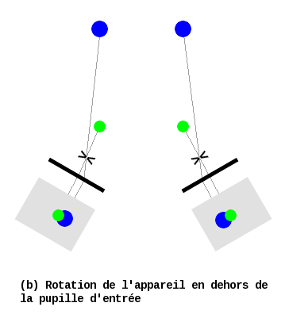

Recherche de la position de la pupille d'entrée
-----------------------------------------------

L'objectif est de faire coïncider la pupille d’entrée de l'objectif et l’axe de
rotation vertical de la tête panoramique.

Placez l’ensemble photoscope + tête panoramique + trépied au plus près d’un
élement fixe dont on observera le déplacement par rapport à un autre élément
lointain pendant que vous faites tourner le photoscope.

La photo ci-dessous montre le mode opératoire de la rotation (pour
l'observation) et de la translation (pour la correction) :

C’est une recherche itérative : on recommence autant de fois que nécessaire par
tatonnement. A chaque tentative, on avance ou recule le photoscope sur la tête
panoramique et on la fait tourner sur elle même. Au début, lorque le réglage est
encore grossier, on verra les deux éléments se déplacer l’un par rapport à
l’autre dans le viseur ou sur l'écran arrière. Lorsque l’on approchera de la
bonne position, il devient plus difficile d’observer ce déplacement. On
affichera l'image sur l'écran arrière en appliquant un grossissement X10.

Schéma de principe lorsque le photoscope tourne autour de la pupille d’entrée :

Illustration de cette situation avec une vidéo prise pendant la rotation du
photoscope :

.. raw:: html

        <video controls height="300" width="425">
                <source src="videos/MAQ00114.mp4" type="video/mp4">
                Sorry, your browser doesn't support embedded videos.
        </video>

La porte ne se déplace pas par rapport au meuble de l'avant plan.

Schéma de principe lorsque le photoscope ne tourne pas autour de la pupille
d’entrée :

Illustration de cette situation avec une vidéo prise pendant la rotation du
photoscope :

.. raw:: html

        <video controls height="300" width="425">
                <source src="videos/MAQ00113.mp4" type="video/mp4">
                Sorry, your browser doesn't support embedded videos.
        </video>

La porte se déplace par rapport au meuble de l'avant plan !

**Liens**

- `La pupille d'entrée <http://www.guide-photo-panoramique.com/pupille-entree.html>`_ ;
- `Wikipédia : Parallaxe <http://fr.wikipedia.org/wiki/Parallaxe>`_ ;
- `Theory of the "no-parallax" Point in Panorama Photography <http://www.janrik.net/PanoPostings/NoParallaxPoint/TheoryOfTheNoParallaxPoint.pdf>`_ ;
- `FINDING THE NO-PARALLAX POINT <http://www.johnhpanos.com/epcalib.htm>`_ ;
