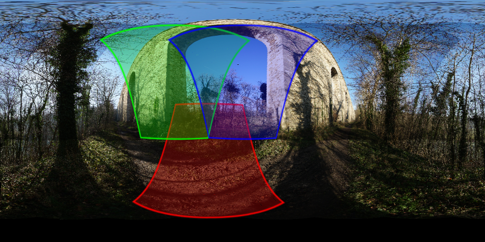
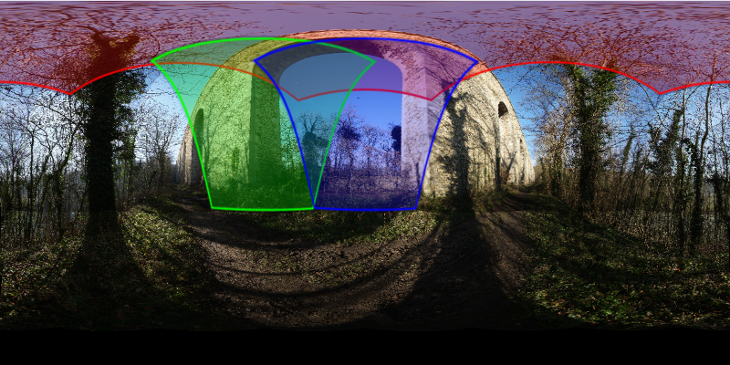
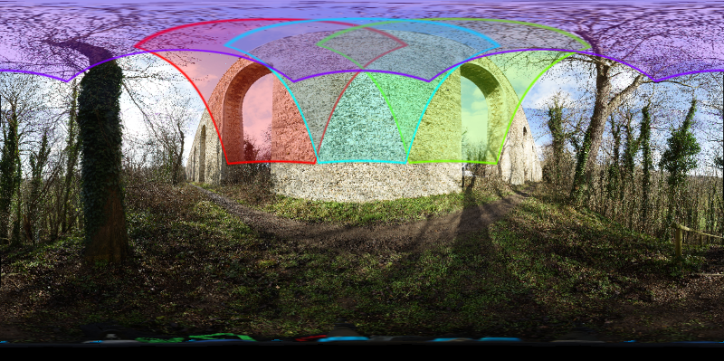
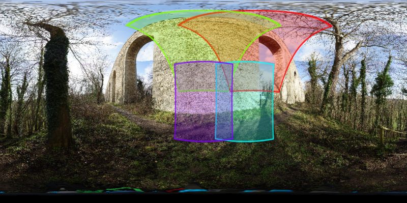
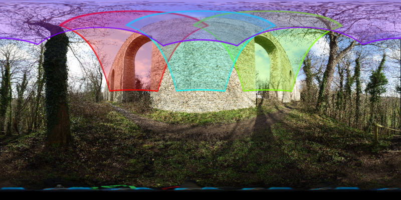
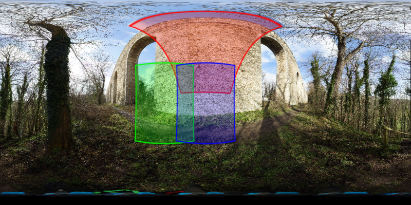
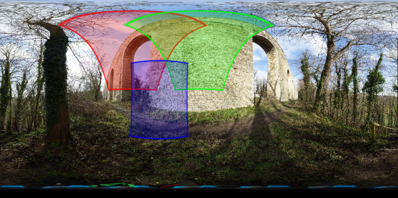

Choix du schéma de prise de vue
-------------------------------

Concrètement, c'est la combinaison de la rotation autour des axes verticaux et
horizontaux qui définit le schéma de prise de vue. Ses paramètres sont les
suivants :

- les angles de champ horizontaux (ou le nombre de vues horizontales) et
  verticaux (ou le nombre de rangées horizontales). Voir le tableau ci-dessous ;
- le taux de recouvrement entre deux vues adjacentes horizontales ou verticales ;
- l'agencement des rangées horizontales : alignées en mosaïque ou avec
  entrelacement ;
- les angles de rotations disponibles sur le barillet de la tête panoramique ;

Pour aider la prise de décision, il est utile de calculer les angles de champ
horizontaux et verticaux. Ils sont fonction de la focale de l'objectif et des
dimensions du capteur (`formulaires de calcul de photographie
<formulaires-photographie.rst>`_). Les dimensions du capteur :

=============== ======= =======
Photoscope      Hauteur Largeur
=============== ======= =======
Sony Alpha 6000 15,6 mm 23,5 mm
Sony Alpha 7R   23,9 mm 35,8 mm
=============== ======= =======

Du fait de l'orientation du photoscope en mode portrait, la hauteur (resp.
largeur) du capteur est affectée à l'angle horizontal (resp. vertical).

=============== ============= ========== ========
Photoscope      Objectif      Horizontal Vertical
=============== ============= ========== ========
Sony Alpha 6000 Samyang 12 mm 66.05°     88.8°
Sony Alpha 7R   Samyang 24 mm 52,94°     73,44°
=============== ============= ========== ========

Les angles à régler sur le barillet de rotations devront être plus petits que
ces valeurs pour qu'il y ait un recouvrement suffisant (entre 25% et 33%).

A partir des angles de rotation et des angles de champ, on définit un
pourcentage de recouvrement :

::

        recouvrement = angle de rotation / angle de champ x 100

Le nombre minimal (recouvrement = 0%) de rangées horizontales se calcule par
180° / angle de champ vertical

Le nombre minimal  (recouvrement = 0%) de vues horizontales se calcule par 360°
/ angle de champ horizontal :

**Sur Sony Alpha 6000**

============= ============================== ============================
Objectif      Nombre de rangées horizontales Nombre de rangées verticales
============= ============================== ============================
Samyang 12 mm 5.45                           2.03
============= ============================== ============================

J'adopterai donc un schéma à deux rangées entrelacées.

+----------------------+----------------------------------------------------------------------+----------------+
| Objectif + tête pano | Schéma                                                               | Nombre de vues |
+======================+======================================================================+================+
| Samyang 12 mm        | 2 rangées + zénith + nadir :                                         | 16             |
| Sur Nodal Ninja 3 +  |                                                                      |                |
| plateau 25.7° n=14   | - [1] 7 prises de vue à 51,4° horizontalement  et +30° verticalement |                |
|                      | - [2] 7 prises de vue à 51,4° horizontalement  et -30° verticalement |                |
|                      | - [3] 1 prise de vue à +90° (zénith)                                 |                |
|                      | - [4] 1 prise de vue à -90° (nadir)                                  |                |
|                      | - Note : les rangées sont décalées de 25,7° horizontalement          |                |
+----------------------+----------------------------------------------------------------------+----------------+

Voici une visualisation des recouvrements pour ce schéma :

Notez le décalage entre la rangée supérieure et la rangée inférieure de 25,7°.
Le résultat obtenu est optimal.

**Sur Sony Alpha 7R**

============= ============================== ============================
Objectif      Nombre de rangées horizontales Nombre de rangées verticales
============= ============================== ============================
Samyang 24 mm 6,80                           2,45
============= ============================== ============================

Deux rangées seraient trop peu, j'adopte donc à un schéma à 3 rangées ce qui
produira un taux de recouvrement vertical assez élevé.

Voici les schémas de prise de vue que j'utilise :

+----------------------+----------------------------------------------------------------------+----------------+
| Objectif + tête pano | Schéma                                                               | Nombre de vues |
+======================+======================================================================+================+
| Samyang 24 mm        | 3 rangées + zénith + nadir :                                         | 28             |
| sur Nodal Ninja 5 +  |                                                                      |                |
| RD16 (sécurité)      | - [1] 8 prises de vue à 45° horizontalement  et +45° verticalement   |                |
|                      | - [2] 8 prises de vue à 45° horizontalement  et -45° verticalement   |                |
|                      | - [3] 10 prises de vue à 36° horizontalement  et 0° verticalement    |                |
|                      | - [4] 1 prise de vue à +90° (zénith)                                 |                |
|                      | - [5] 1 prise de vue à -90° (nadir)                                  |                |
+----------------------+----------------------------------------------------------------------+----------------+

Voici une visualisation des recouvrements pour ce 1er schéma :

J'essaie de réduire le nombre de photos en essayant un espacement de 60°
horizontal au lieu de 45° pour les deux rangées à 45° vers le haut et 45° vers
le bas. J'aurai donc 6 photos au lieu de 8 par rangée, ce qui permet
d'économiser 4 photos.

+----------------------+----------------------------------------------------------------------+----------------+
| Objectif + tête pano | Schéma                                                               | Nombre de vues |
+======================+======================================================================+================+
| Samyang 24 mm        | 3 rangées + zénith + nadir :                                         | 24             |
| sur Nodal Ninja 5 +  |                                                                      |                |
| RD16 _ (risqué mais  | - [1] 6 prises de vue à 60° horizontalement  et +45° verticalement   |                |
| c'est celui que      | - [2] 6 prises de vue à 60° horizontalement  et -45° verticalement   |                |
| j'utilise !          | - [3] 10 prises de vue à 36° horizontalement  et 0° verticalement    |                |
|                      | - [4] 1 prise de vue à +90° (zénith)                                 |                |
|                      | - [5] 1 prise de vue à -90° (nadir)                                  |                |
+----------------------+----------------------------------------------------------------------+----------------+

Voici une visualisation des recouvrements pour le 2ème schéma :

Les deux premières images montrent un recouvrement suffisant mais la troisième
montre un risque potientiel de zone non couverte. J'ai qualifié ce schéma de
risqué, en effet on voit que l'intersection des trois images est extrèmement
réduit. Il est utilisable mais il faut très bien maîtriser l'angle vertical
(tilt) faute de quoi un "trou" sera visible dans le panorama final. Cela est
faisable avec la Nodal Ninja 5 dont le barillet qui contrôle l'angle vertical
possède des crans tous les 15°. Sans ce crantage, je ne me serais pas aventuré
avec ce schéma et je me serais rabattu sur le premier.

**Liens**

- `Angle de champ <http://fr.wikipedia.org/wiki/Angle_de_champ>`_ ;
- `CHAMP  ANGULAIRE  DES  OBJECTIFS <http://becot.info/photo/francais/champangulaire.htm>`_ ;
- `Angle de champ_ <http://www.panochrome.fr/articles/Angle_de_champ.pdf>`_ .
