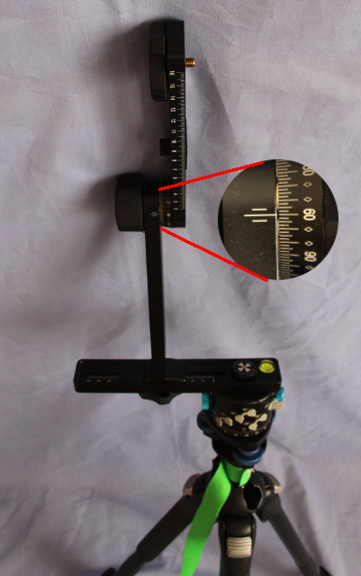
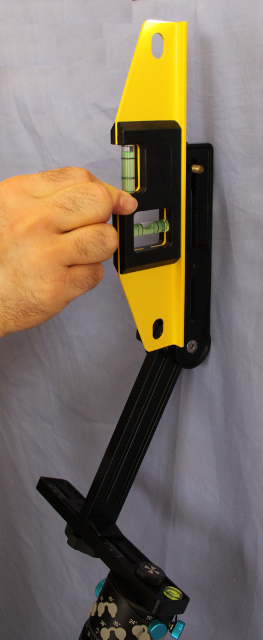
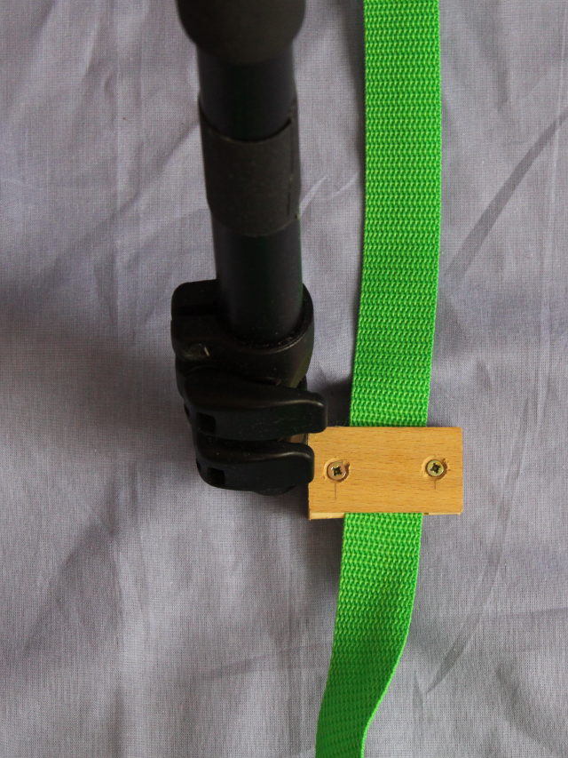
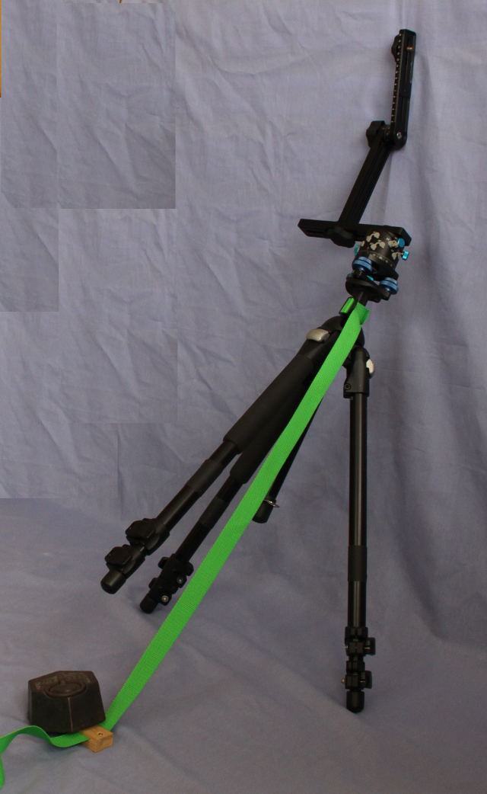

Repères pour la prise du nadir
------------------------------

On peut prendre le nadir à main levée lorsque le temps d'exposition permet
d'éviter le flou de bouger. Pour des temps de pose longs, on ne peut se passer
du trépied. J'utilise donc le trépied en position inclinée de manière à garder
les mêmes paramètres d'exposition que pour les autres vues.

Les photos d'illustration montrent les pieds rétractés par facilité mais la
manipulation se fait bien entendu avec les pieds déployés.

Le réglage consiste à déterminer la longueur d'une sangle fixée sur la colonne
centrale du trépied. Vous pouvez voir l'utisation de ce réglage dans l'article
`« Prise des clichés » <{filename}prise-de-cliches.rst>`_.

L'angle de basculement est de 30°, on régle donc l'angle vertical sur 60°.
Pensez à verrouiller la rotation du barillet en serrant la vis prévue à cet
effet pour éviter que la tête se mette à tourner sur elle-même. Sur-élevez la
colonne centrale d'une dizaine de centimètres et serrez y une sangle. Inclinez
le trépied en le basculant et en le maintenant dans cette position. Modifiez la
position jusqu'à ce que le bras soit vertical.

Vous pouvez vous aider d'un niveau à bulle comme illustré dans la photo
ci-dessous :

Une fois ceci effectué, rebasculez le trépied en position verticale. Un repère
provisoirement coulissant est monté sur la sangle. Posez ce repère  à côté du
pied qui va s'élever et maintenez le en position en position fixe par rapport au
sol.

Tout en immobilisant le repère au sol en appuyant dessus à l'aide de votre pied
(un poids sur la photo), rebasculez le trépied dans sa position inclinée
précédente. La sangle coulisse à l'intérieur du repère pendant la manœuvre. Il
suffit ensuite d'immobiliser le repère sur la sangle.

**Liens**

- `How to take a perfect NADIR image for spherical panoramas without taking the camera from the panohead <http://www.panoramas.dk/panorama/nadir/>`_.
