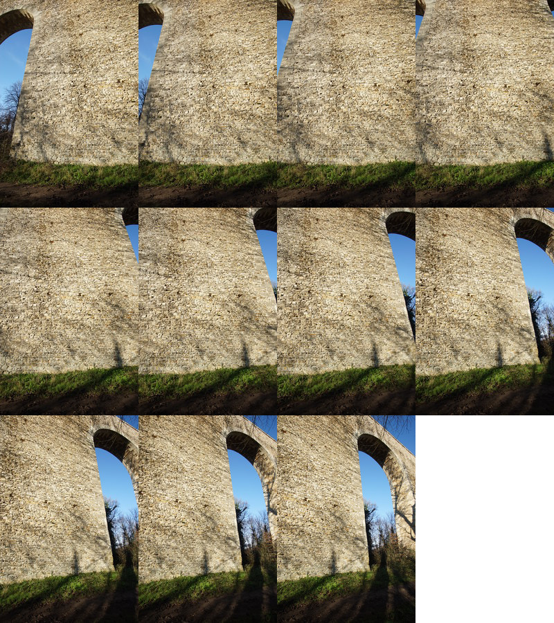

Correction de la distorsion de l'objectif
-----------------------------------------

Commencez par prendre une dizaine de photos assez rapprochées d'une surface qui
occupera la totalité de chaque photo.

Par exemple, voici sous forme de planche les 11 photos espacées de 5° que j'ai
utilisées pour calibrer l'ensemble Sony Alpha 6000 + Samyang 12mm :

Vous pouvez `télécharger le
tout <http://transferts.franck-barbenoire.fr/hugin/calibration-a6000.tgz>`_. J'y
ai inclus le projet Hugin mais vous pouvez l'effacer pour démarrer de zéro afin
de vous entraîner.

Vous allez créer un projet avec Hugin, vous n'effectuerez que les étapes
d'optimisation sans produire le panorama correspondant.

- lancez Hugin (version 2014.0.0) ;
- passez en mode "Expert" : Interface -> Expert ;
- passez à l'onglet **Photos** où tout se passe ;
- cliquez le bouton **Ajout d'images...** ;
- choisissez toutes les images de votre panorama et validez ;
- si les données exif sont incomplètes dans les fichiers des images (en cas
  d'absence de couplage avec l'objectif), il faudra saisir manuellement la
  focale de l'objectif. L'angle de champ horizontal est calculé automatiquement,
  veillez à ce qu'il correspond bien à l'angle de champ horizontal calculé. Si
  ce n'est pas le cas, cela veut dire que l'image n'est pas correctement
  orientée. Dans un tel cas j'utilise un outil de réorientation des images (cf
  liens "Exif Orientation Tag" ci-dessous) :

 .. code-block:: bash

        exifautotran *.JPG

- cliquez le bouton **Créer des points de contrôle** en gardant la méthode de
  recherche propre à Hugin : **CPFind**. Une fenêtre s'ouvre pour indiquer le
  nombre de points de contrôle créés ;
- dans la liste déroulante **Optimiser -> Géométrique**, choisissez les
  paramètres à optimiser dans la liste déroulante : **Les positions, la
  translation, la vue et la distorsion en barilllet (y,p,r,x,y,z,v,b)** ;
- cliquez le bouton **Calculer** en face de la liste déroulante. Appliquez les
  modifications ;
- cliquez droit sur n'importe qu'elle ligne d'image et sélectionnez **objectif
  -> enregistrez l'objectif dans le fichier ini**. Ce fichier contient les
  paramètres de l'objectif et sera utilisé lors de la production du panorama ;
- quittez Hugin sans sauvegarder le projet, il ne sera pas réutilisé ;

Résultat pour le Samyang 12 mm sur Sony Alpha 6000 :

 .. code-block:: ini

        [Lens]
        image_width=4000
        image_height=6000
        type=0
        hfov=64.1819
        hfov_link=1
        crop=1
        a=0
        a_link=1
        b=-0.0122437
        b_link=1
        c=0
        c_link=1
        d=0
        d_link=1
        e=0
        e_link=1
        g=0
        g_link=1
        t=0
        t_link=1
        Va=1
        Va_link=1
        Vb=0
        Vb_link=1
        Vc=0
        Vc_link=1
        Vd=0
        Vd_link=1
        Vx=0
        Vx_link=1
        Vy=0
        Vy_link=1
        Er=1
        Er_link=0
        Eb=1
        Eb_link=0
        Ra=0
        Ra_link=1
        Rb=0
        Rb_link=1
        Rc=0
        Rc_link=1
        Rd=0
        Rd_link=1
        Re=0
        Re_link=1
        [Lens/crop]
        enabled=0
        autoCenter=1
        left=0
        top=0
        right=4000
        bottom=6000
        [EXIF]
        CameraMake=SONY
        CameraModel=ILCE-6000
        FocalLength=12
        Aperture=0
        ISO=100
        CropFactor=1
        Distance=0

Résultat pour le Samyang 24 mm sur Sony Alpha 7R :

 .. code-block:: ini

        [Lens]
        image_width=4912
        image_height=7360
        type=0
        hfov=52.1898
        hfov_link=1
        crop=1
        a=0
        a_link=1
        b=-0.0134505
        b_link=1
        c=0
        c_link=1
        d=0
        d_link=1
        e=0
        e_link=1
        g=0
        g_link=1
        t=0
        t_link=1
        Va=1
        Va_link=1
        Vb=0
        Vb_link=1
        Vc=0
        Vc_link=1
        Vd=0
        Vd_link=1
        Vx=0
        Vx_link=1
        Vy=0
        Vy_link=1
        Er=1
        Er_link=0
        Eb=1
        Eb_link=0
        Ra=0
        Ra_link=1
        Rb=0
        Rb_link=1
        Rc=0
        Rc_link=1
        Rd=0
        Rd_link=1
        Re=0
        Re_link=1
        [Lens/crop]
        enabled=0
        autoCenter=0
        left=0
        top=0
        right=4912
        bottom=7360
        [EXIF]
        CameraMake=SONY
        CameraModel=ILCE-7R
        FocalLength=24
        Aperture=0
        ISO=100
        CropFactor=1
        Distance=0

**Liens**

- `Exif Orientation Tag (Feb 17 2002) <http://sylvana.net/jpegcrop/exif_orientation.html>`_
- `Lens profiling with Hugin <http://oclug.on.ca/archives/photography-sig/attachments/20101111/eee1f142/attachment-0001.pdf>`_ ;
- `Correcting Lens Distortions in Digital Photographs <http://www.imagemagick.org/Usage/lens/correcting_lens_distortions.pdf>`_ ;
- `Lens correction model <http://wiki.panotools.org/Lens_correction_model>`_ ;
- `Calculating Lens Distorsion <http://lensfun.berlios.de/lens-calibration/lens-distortion.html>`_ ;
- `Creating lens distorsion models with Hugin's lens calibrator <http://libregraphicsworld.org/blog/entry/creating-lens-distorsion-models-with-hugin-lens-calibrator>`_ ;
- `Hugin : calibration de l'objectif <http://hugin.sourceforge.net/tutorials/calibration/en.shtml>`_
- `Calibration de caméra par acquisition de type panoramique <http://recherche.ign.fr/labos/matis/pdf/articles_revues/2011/cannelle_RFPT_194.pdf>`_
