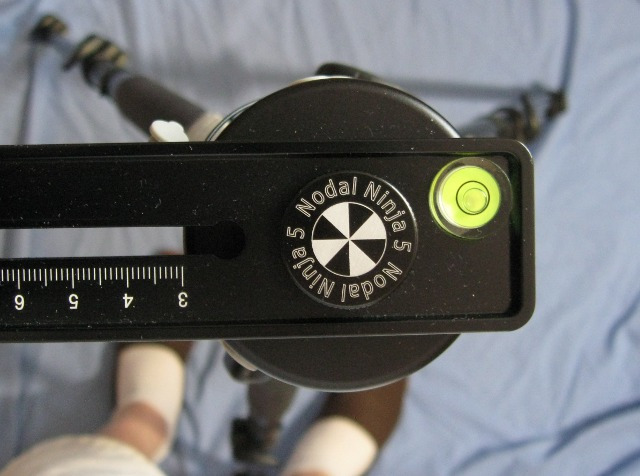

Réglages en situation
========================

Ces règlages sont à faire à chaque fois que l’on désire prendre une série de
clichés.

Installation du trépied
-----------------------

Assurez vous que les conditions d'illumination (naturelles ou artificielles)
seront constantes durant toute la durée de la prise de vues. Si un nuage est sur
le point de masquer le soleil, attendez qu'il soit complètement passé ou au
contraire, assurez vous de pouvoir prendre toutes les vues durant sa présence.

Déployez les pieds en totalité ou partiellement pour tenir compte de la
déclivité ou l'irrégularité du terrain. La verticalité n'a pas besoin d'être
parfaite. Elle doit être cependant suffisante pour assurer un bon équilibre et
une bonne stabilité du trépied. L'horizontalité fine de la tête panoramique sera
obtenue grace à la platine de mise à niveau.

Assurez vous de pouvoir circuler aisément autour du trépied. Un seul coup de
pied et il faudra tout recommencer !

En cas de prise de vue sous le soleil ou d'éclairage artificiel très fort, vous
devez portez attention aux problèmes suivants :

- ombre du trépied projetée au sol. Choississez un lieu permettant de l'éliminer
  ou de la minimiser ;
- votre propre ombre. La plupart du temps il suffit de se décaler et/ou
  s'accroupir. La télécommande a cet avantage de pouvoir continuer à déclencher
  tout en s'éloignant  ;

Réglages de la tête panoramique
-------------------------------

- reproduire les réglages obtenus au chapitre 2 : « Préparatifs » :
   - position de l'équerre sur le bras horizontal ;
   - position du plateau de montage sur le bras rotatif ;
   - fixez les angles de rotation vertical et horizontal sur les barillets ;

- Faire le niveau de la tête panoramique grâce au niveau à bulle.

3.3 Réglages de l'appareil photo
--------------------------------

Pour faciliter les traitement ultérieurs, les clichés seront pris en mode manuel
intégral, aucun paramètre affectant l'exposition ou la mise au point ne devra
pouvoir varier pendant la séance de prise de vue.

- reproduire les réglages obtenus au chapitre 2 : « Préparatifs » :
- réglez la mise au point déterminée lors de la détermination de la distance
  l'hyperfocale ;
- réglez la sensibilité et la balance des blancs suivant vos désirs (mais pas en
  automatique !) ;
- réglez le mode de mesure d'exposition : l'évaluation multizones me parait de
  bon aloi ;
- réglez l'ouverture (celle qui a servi à la détermination de la distance
  hyperfocale !) ;
- mettez l'appareil  en **mode priorité à l'ouverture** et faites une évaluation
  de l'exposition sur le sujet principal de la scène (par exemple). Mémorisez la
  vitesse (dans votre tête, pas sur le boitier ;-) ;
- mettez l'appareil  en **mode manuel** et fixez l'ouverture et la vitesse
  obtenues ci-dessus ;
- faites une évaluation de l'exposition sur l'ensemble de la scène. Observez
  l'indicateur de sur/sous exposition. Eventuellement ajustez l'exposition pour
  obtenir une exposition moyenne en modifiant la vitesse. Gardez l'ouverture et
  la sensibilité constantes ;
