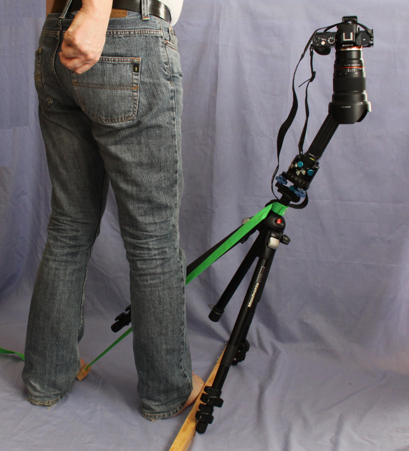
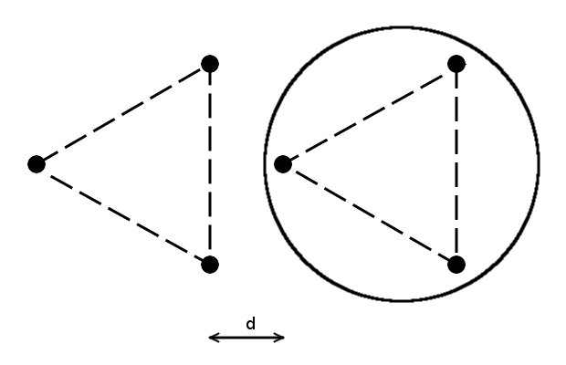
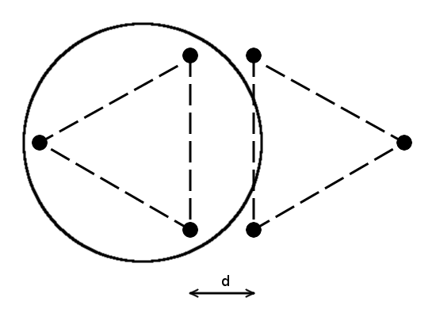

Prise des clichés
=================

Suivi du schéma de prise de vue
-------------------------------

Tournez autour du trépied tout en prenant les clichés et en faisant attention à
ne pas modifier la position du trépied (coup de pied maladroit !). Prenez chaque
rangée l'une après l'autre en changeant l'angle vertical (tilt) pour chacune.

L’utilisation d’une télécommande augmente la vitesse des prises de vues en
limitant les allers-retours de la main entre la tête panoramique et le
déclencheur tout en limitant les flous de bouger.

Prise du nadir
--------------

La position inclinée est maintenue à l'aide d'une sangle maintenue au sol par
pression du pied. Une main est utilisée pour déclencher à l'aide de la
télécommande et l'autre reste disponible pour retenir le trépied en cas de
basculement accidentel ! Il faut s'assurer que la nature du sol permet au
trépied de se maintenir sous peine de faire tomber photoscope et objectif (aie
!). En cas de mauvaise adhérence, vous pouvez utiliser un tasseau de bois pour
éviter la glissade comme je le montre ci-dessous.

Un point important auquel prêter attention : la nouvelle position du trépied
pour son basculement. Les deux pieds restant au sol doivent se trouver hors de
l'emprise du trépied dans sa position originale. Faute de quoi, il manquera des
morceaux au moment du montage !

Pour pouvoir appliquer correctement cette consigne, il faut bien avoir fait
attention où se trouve le trépied avant de déplacer. Il faut y avoir pensé au
moment où l'on pose lé trépied pour rendre le repérage de cette position plus
aisée.

Le cercle des illustrations ci-dessous matérialise l'emprise du trépied au sol
lorsqu'il est dans sa position originale (avant son déplacement pour la prise du
nadir).

Ci dessous, une bonne position pour le basculement du trépied.

Ci dessous, une mauvaise position pour le basculement du trépied.

**Liens**
