Production du panorama
======================

Généralités sur les projections
-------------------------------

**Liens**

- `Comprendre les types de projection <http://www.autopano.net/wiki-fr/Comprendre_les_types_de_projection>`_ ;
- `Panorama formats <http://wiki.panotools.org/Panorama_formats>`_.

Préparatifs
-----------

Correction des informations exif :

::

    exifautotran *.JPG

**Correction de la distortion de l'image du nadir**

Il s'agit de l'image du nadir prise à main levée ou en inclinant le trépied (nadir.jpg).

- lancez **Hugin** ;
- cliquez l'onglet **Images** ;
- cliquez le bouton **Ajoutez des images individuelles...** et sélectionnez
  l'image du nadir (exemple : première image ci-dessous) ;
- si nécessaire (si il n'y a pas de données EXIF comme dans le cas d'un objectif
  sans couplage), entrez la distance focale de l'objectif ;
- cliquez l'onglet **Appareil photo et objectif** ;
- cliquez sur la ligne de l'image ;
- cliquez le bouton **Chargez l'objectif...** et selectionnez le fichier de
  paramètres de l'objectif ;
- cliquez l'onglet **Assemblage** ;
- dans la liste déroulante Projection, choisissez **Rectilinéaire** ;
- cliquez successivement les boutons **Calculez l'angle de champ** puis
  **Calculez la taille optimale** ;
- cliquez le bouton **Assembler...** et sauvegardez successivement le projet et
  l'image du nadir corrigée ((exemple : deuxième image ci-dessous)) ;

Voici un exemple d'une image de nadir, nadir.jpg

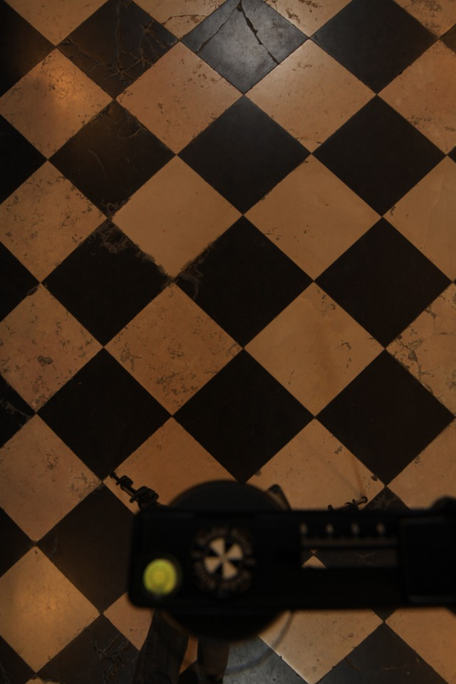

et la même image après correction des distorsions (nadir_correct.jpg) :

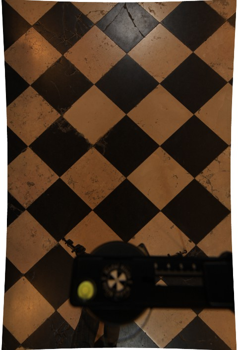

Utilisation du logiciel d’assemblage Hugin
------------------------------------------

**Liens**

- `Hugin : tutorial <http://maxknopp.free.fr/filebrowser/upload/documents/Tutorial_Panoramique.pdf>`_ ;
- `Hugin : un utilitaire avancé pour faire des panoramas <http://doc.ubuntu-fr.org/hugin>`_ ;
- `Tutorial Hugin n°1 : Découverte et prise en main du logiciel <http://www.selme.fr/tutoriel_hugin/1-Decouverte_hugin.pdf>`_ ;
- `Tutorial Hugin n°2 : Réalisation d'un panorama <http://www.selme.fr/tutoriel_hugin/2-Premier_panorama.pdf>`_ ;
- `Tutorial - Workflow avec Hugin <http://pmllc.free.fr/panophoto/hugin/tutorial_hugin.pdf>`_ ;

Conversion de l'image équirectangulaire en faces de cube
--------------------------------------------------------

Voir mon article sur le sujet `Décomposition d’une image panoramique en faces de cube <linux/photo/decomposition-equi-cube.rst>`_.

A la fin du processus, on obtient les 6 faces du cube. Voici celle de la face
inférieure d.tif (d comme down, "bas" en anglais) qui nous servira dans la
section suivante :

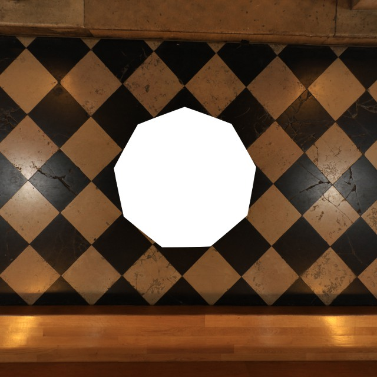

Insertion du nadir dans la face inférieure du cube
--------------------------------------------------

- lancez **The Gimp** ;
- ouvrez les deux images (**Fichier**  <** Ouvrir...**) du nadir : celle dont dont a corrigé la distorsion nadir_correct.jpg et la face inférieure du cube d.tif  (cf ci-dessus pour les deux images) ;
- supprimez les éléments perturbateurs dans image d.tif, choisissez un outil de sélection dans la boîte à outils puis supprimez (**Edition**  < **Effacer** ou CTRL-X) les éléments présents dans d.tif qui sont absents de nadir_correct.jpg (les extrémités du trépied par exemple) ;
- enregistrer d.tif (**Fichier**  < **Enregistrer** ou CTRL-S);
-  sélectionnez une partie de l'image nadir_correct.jpg qui couvrira entièrement le « trou » du trépied dans d.tif ;
- copiez cette sélection que l'on appellera la « rustine »  (**Edition**  < **Copier** ou CTRL-C) ;
- collez la rustine en tant que nouveau calque (**Edition**  < **Coller comme** -> **Nouveau calque**) dans l'image de d.tif. Le calque sélectionné est le dernier collé ;
- veillez à ce que le calque de la rustine soit toujours le calque sélectionné ;
- à l'aide des outils **déplacement** et **rotation** centrez et orientez approximativement la rustine au dessus du « trou » (exemple : première image ci-dessous) ;
- faites apparaître la fenêtre des calques (**Fenêtre**  < **Fenêtre ancrables** -> **Calques**) ;
- cliquez l'outil **Perspective** dans la boîte à outils ;
- décochez l'oeil correspondant au calque de la rustine dans la fenêtre des calques ;
- cliquez sur la rustine puis déformez la en déplaçant les quatre coins de manière que ses bords se superposent parfaitement a l'image du fond. Faites varier l'opacité de la sélection pour évaluer la qualité de la déformation (exemple : deuxième image ci-dessous) ;
- cliquez sur **Transformer** pour valider la nouvelle perspective. La rustine disparaît ;
- supprimez les parties excédentaires de la rustine : à l'aide des outils de sélection, sélectionnez des zones dans l'image de fond en laissant une marge autour du « trou » et supprimez les (**Edition**  < **Effacer** ou CTRL-X). Bien que la rustine ne soit pas visible, les zones sont bien effacées dans son calque puisqu'il est toujours sélectionné ;
- mettez le calque de la rustine aux dimensions de l'image : dans la fenêtre des calques, cliquez droit sur son calque puis choisissez **Calque aux dimensions de l'image** dans le menu contextuel ;
- recochez l'oeil correspondant au calque de la rustine dans la fenêtre des calques. La rustine réapparaît et vous découvrer les zones rognées ;
- supprimez le calque de l'image de fond : dans la fenêtre des calques, cliquez droit sur le calque correspondant à l'image de fond puis choisissez **Supprimer le calque** dans le menu contextuel ;
- enregistrer l'image au format .tif pour garder le canal alpha (la transparence !) : **Fichier**  < **enregistrer sous**. Appelons d_1.tif ce fichier (exemple : troisième image ci-dessous) ;
- fusionner les deux images d.tif et d_1.tif, appelons d_2.tif l'image fusionnée  (exemple : cinquième image ci-dessous) :

::

        enblend -o d_2.tif d.tif d_1.tif

- remplacez l'image d'origine par l'image finale et effacez les images intermédiaires :

::

        mv d_2.tif d.tif
        rm d_1.tif

Exemples :

1. rustine déplacée et orientée de manière à couvrir tout le « trou»

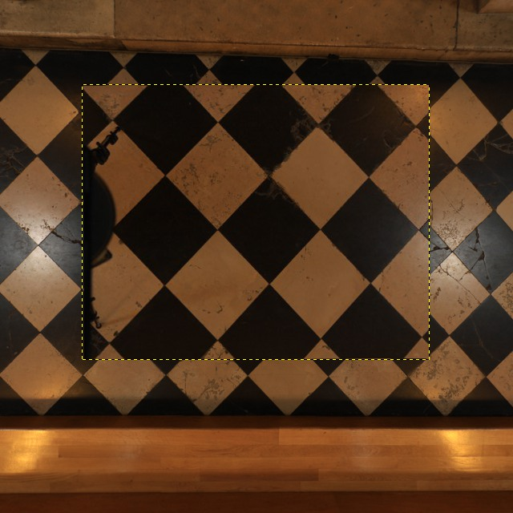

2. rustine déformée, les poignées sont situées aux quatre sommets du quadrilatère :

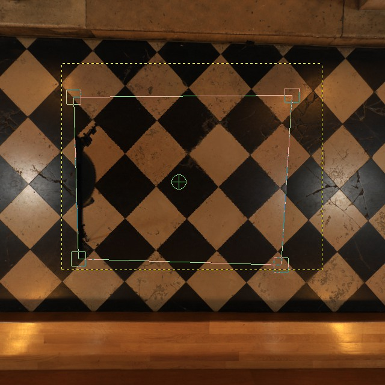

3. calque de la rustine mis aux dimensions de l'image (d_1.tif)

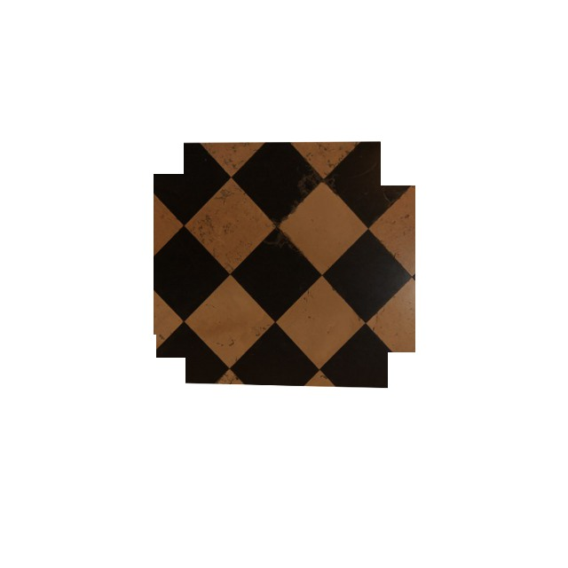

4. image finale (d_2.tif)

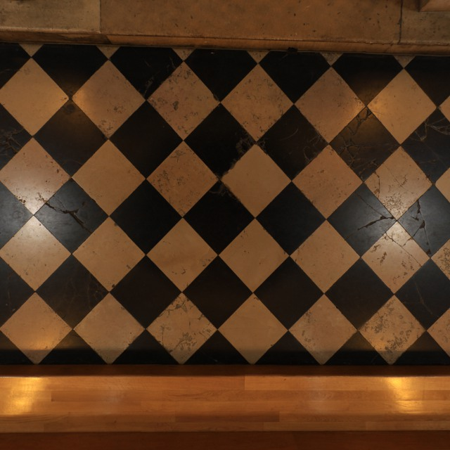

**Liens**

- `Edit the nadir, part I <http://panospace.wordpress.com/2008/03/18/edit-the-nadir/>`_ ;
- `Edit the nadir, part II <http://panospace.wordpress.com/2008/03/24/edit-the-nadir-part-ii/>`_ ;
- `Edit the Nadir and Zenith of an Equirectangular Panorama <http://theseblog.free.fr/2007/08/edit-nadir-and-zenith-of.php>`_ ;
- `Using enblend to fill the "Hole in the floor" <http://wiki.panotools.org/Using_enblend_to_fill_the_%22Hole_in_the_floor%22>`_ ;
- `Stitching Nadir Shots <http://wiki.panotools.org/Stitching_Nadir_Shots>`_ ;
- `How to use enblend for patching zenith and nadir images <http://wiki.panotools.org/How_to_use_enblend_for_patching_zenith_and_nadir_images>`_.

Retouches finales
-----------------

Les erreurs d'assemblage sont hélas assez fréquentes (cf image 1 ci-dessous).
Pour les éliminer on peut jouer sur les calques d'inclusion dans l'interace de
Hugin. Cette technique montre toutefois ses limites : protéger une zone par un
masque d'inclusion se traduit par une erreur d'assemblage dans une autre zone.
Personnellement, je m'arrête à une seule itération. Ensuite j'utilise la
technique suivante décrite ci-dessous.

Image 1 : zoom sur une erreur d'assemblage

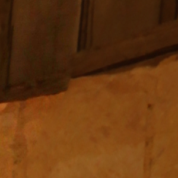

La technique suivante est basée sur le même principe que l'inclusion du nadir :

- dans les clichés originaux, trouvez celui dans lequel se trouve l'erreur
  d'assemblage. Entre plusieurs candidats possibles, choisissez celui dans
  lequel l'erreur se trouve au plus près du centre de l'image ;
- corrigez les distorsions dues à l'objectif ;
- extrayez de ce cliché par une sélection/copier une zone qui va recouvrir
  l'erreur. Choisissez-là aussi petite que possible (cf image 2) ;
- collez la sélection en tant que nouveau calque dans la face de cube concernée
  par l'erreur ;
- utilisez l'outil de perspective de manière que le recouvrement soit optimum
  (cf image 3) ;
- dimensionnez le calque à la taille de l'image ;
- ci-nécessaire, supprimez les parties inutiles par sélection/suppression ;
- utilisez la gomme pour estomper les bords. Ajustez l'opacité et la taille de
  la gomme à votre convenance (cf image 4) ;
- fusionnez les calques vibles et enregistrez la face de cube corrigée  (cf
  image 5) ;

Image 2 : sélection d'une zone de recouvrement pour correction de l'erreur
d'assemblage

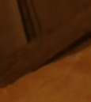

Image 3 :  zone de recouvrement  en cours de transformation par l'outil de
perspective

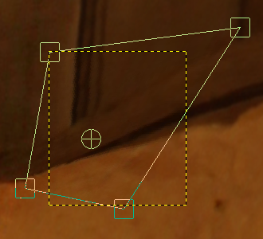

Image 4 : bords de la zone de recouvrement estompé par la gomme

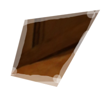

Image 5 : résultat final, l'erreur a disparu ou du moins est beaucoup plus supportable

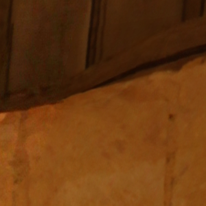

L'inconvénient de cette technique est qu'on ne peut corriger que des zones assez
restreintes. Pour corriger des zones plus étendues, on peut procéder comme suit
(technique décrite dans le lien ci-dessous) :

- dans la face de cube, sélectionnez une zone à déformer ;
- déformez la zone à l'aide de l'outil de cisaillement ou de perspective ;
- reconstituez les parties déplacées par la déformation ;

**Liens**

- `Mending parallax errors with the shear tool <http://wiki.panotools.org/Mending_parallax_errors_with_the_shear_tool>`_ ;
- `Enabling and Testing SSD TRIM Support Under Linux <http://techgage.com/article/enabling_and_testing_ssd_trim_support_under_linux/>`_ ;
- `Tuning Memory Usage <http://enblend.sourceforge.net/enfuse.doc/enfuse_4.0.0.xhtml/Tuning-Memory-Usage.xhtml>`_.
